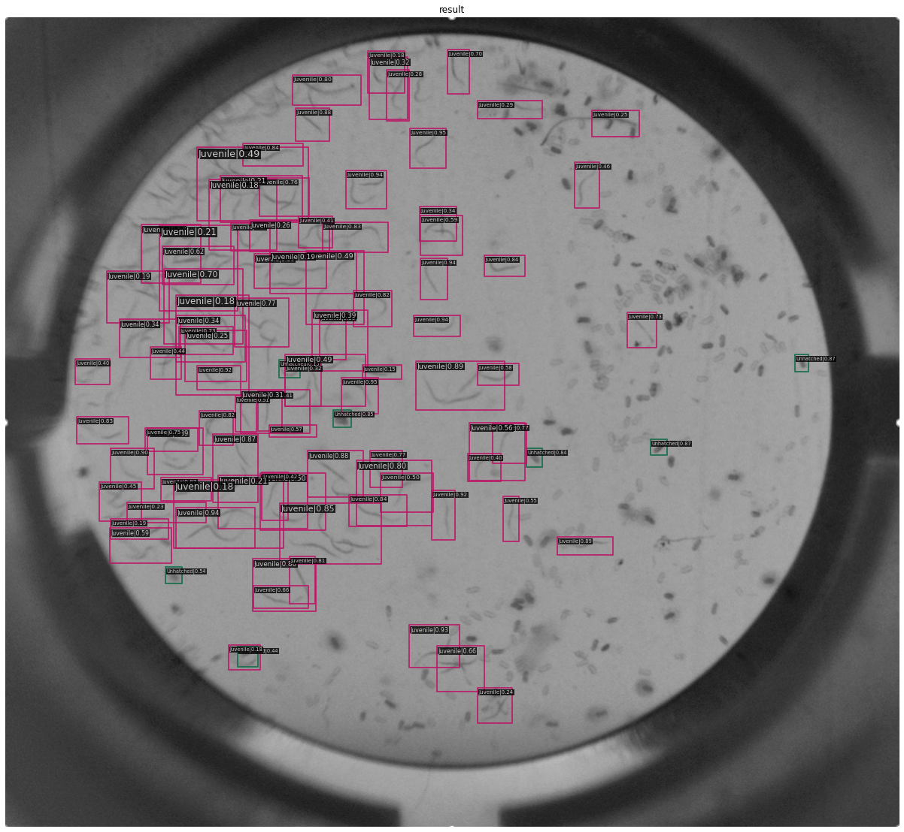

# nematodes_demo, for the data science center away day
some python notebooks based on the MMdet tutorial to update existing mm detector coco networks by transfer learning to
ultimately learn to count/predict nematodes, the eggs it hatched from and unhatched eggs from photos taken from petridishes.

## people involved:

- Noe Germakopoulos Furet
- Julian Evans
- Marc Galland
- Frans van der Kloet

## scripts
- **train_model.ipynb** the main notebook that updates existing network and train new images with very limited number of samples
- **predict.ipynb** a notebook to demonstrate the prediction using existing network
- **MMDet_Tutorial.ipynb** the original notebook from the MMdetection library
- **DSC_DATA_AUG_test.ipynb** initial version of augmenting data

